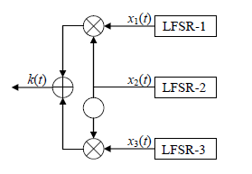

# Генератор Геффе

Простая реализация генератора Геффе - криптографического алгоритма на основе линейных регистров сдвига с обратной связью (LFSR).

## Описание

Генератор Геффе использует три LFSR (LFSR-1, LFSR-3 и управляющий LFSR-2) для создания псевдослучайной последовательности:
- **R0**: полином x⁴ + x³ + 1
- **R1**: полином x⁴ + x + 1  
- **CTRL**: полином x⁴ + x³ + x² + x + 1



## Установка

```bash
git clone https://github.com/DanielCamel/cryptography.git
cd generator